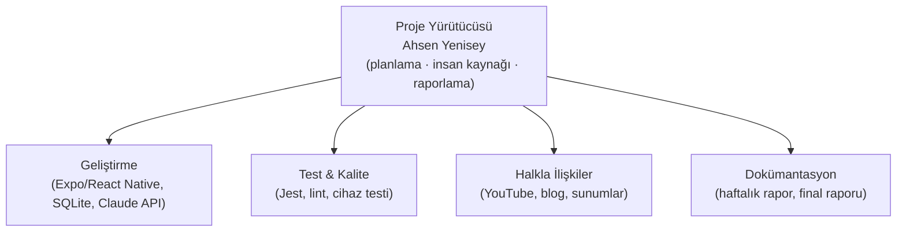

# Proje Yürütücüsü ve Ekip Organizasyon Şeması

**Proje:** Asistanım – Kişisel Sekreter AI
**Ekip büyüklüğü:** 1 kişi (ders yönergesi 1–5 kişiye izin vermektedir)

## 1. Ekip Üyeleri ve Roller

| Üye | GitHub | Rol(ler) | Sorumluluk |
|---|---|---|---|
| **Ahsen Yenisey** | @ahsenyenisey | Proje Yürütücüsü (PY), Geliştirici, Test Sorumlusu, Halkla İlişkiler Sorumlusu | Planlama, insan kaynağı/performans takibi, tüm kodlama, test, tanıtım, raporlama |

> Ekip tek kişiden oluştuğu için ders yönergesindeki tüm roller aynı kişide toplanmıştır. İleride üye katılırsa aşağıdaki şemadaki kutulara dağıtım yapılacak ve `%5 kod katkısı` kuralı GitHub "Contributors" sayfasından izlenecektir.

## 2. Organizasyon Şeması

## 3. İş Kalemi → Rol Eşlemesi

| İş Kalemi | Birincil Rol | Kabul Kriteri |
|---|---|---|
| Kapsam & iş planı | PY | Doküman repoda, sunumda anlatıldı |
| Uygulama iskeleti, navigasyon, tema | Geliştirme | Expo Go'da açılıyor |
| Notlar / Hatırlatmalar / Süreçler | Geliştirme | CRUD + SQLite kalıcılığı |
| Yerel bildirimler | Geliştirme | Gerçek cihazda bildirim geliyor |
| Claude entegrasyonu + çevrimdışı ayrıştırıcı | Geliştirme | "Yarın 15:00 dişçi" → hatırlatma oluşuyor |
| Birim testleri | Test & Kalite | `npm test` yeşil |
| Blog + YouTube | Halkla İlişkiler | Linkler ilerleme raporunda |
| Haftalık raporlar, final raporu | Dokümantasyon | docs/ altında |

## 4. Çalışma Kuralları

1. Kod `main` dalına doğrudan değil, konu dallarından (feature branch) PR ile girer (tek kişilik ekipte küçük düzeltmeler için istisna yapılabilir).
2. Her commit anlamlı bir mesaj taşır (`feat:`, `fix:`, `docs:` ön ekleri).
3. `npm run typecheck && npm run lint && npm test` geçmeden PR birleştirilmez.
4. Her hafta Pazar günü ilerleme raporu `docs/haftalik-raporlar/` altına eklenir.

## 5. Performans Takibi

Proje yürütücüsü her üyenin haftalık görevlerini ve tamamlanma oranını `docs/06-Performans-Takip.md` dosyasında tutar; final raporunda özetler.
